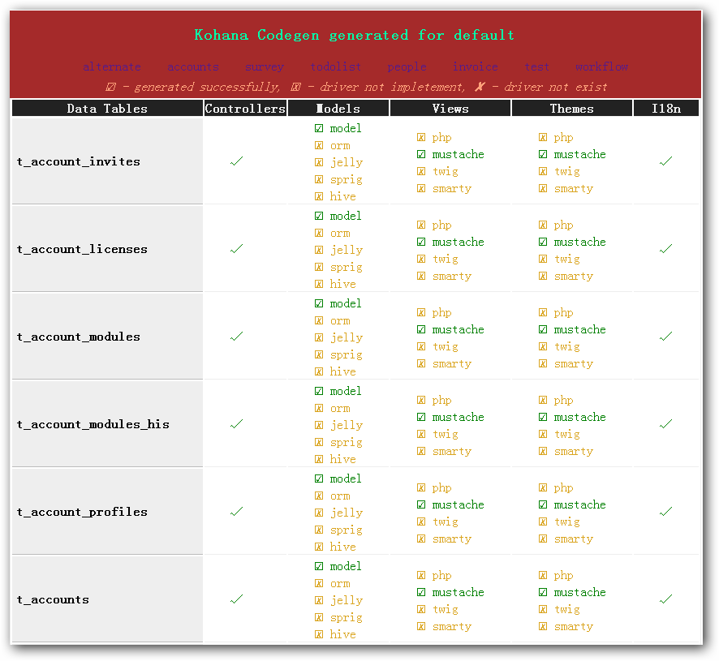

### Auto code generation step by step ###

1. Drop the codegen into `DOCROOT/modules/`, enable codegen module in `application/bootstrap.php`
2. Start to generate source code by access `http://www.example.com/codegen`
2. All source code files will be generated in `DOCROOT/temp/db_group_name/`
4. Generate code from defferent database config group `http://www.example.com/codegen?m=db_group_name`

### Customize step by step ###
6. Generation control in `config/codegen.php`
7. Customize controller classes generation in `classes/codegen/controller.php`
8. Customize model classes generation in `classes/codegen/model.php`
9. Customize view classes generation in `classes/codegen/view.php`
10. Customize view templates generation in `views/codegen/(php | mustache | twig | smarty)/`
11. Customize i18n key-value pairs generation in `classes/codegen/i18n.php`

### Snapshot ###

### ISC License (ISCL) ###

[http://www.opensource.org/licenses/isc-license.txt](http://www.opensource.org/licenses/isc-license.txt)
